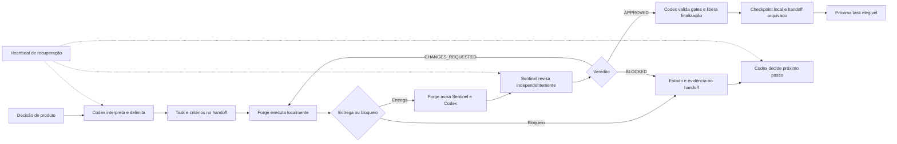

# ConfiOne — modelo de trabalho para construção da aplicação

**Uso:** preparação da apresentação para a diretoria em 25/08/2026
**Produto:** ConfiOne
**Tipo:** briefing conceitual e visual
**Status:** material-base para apresentação; não é backlog, plano de lotes ou
contrato de execução.

## 1. Mensagem central

O ConfiOne está sendo construído por um sistema de trabalho coordenado, no qual
produto, código, documentação, validação e revisão independente formam um ciclo
único. O objetivo não é apenas produzir código, mas transformar uma decisão de
produto em uma entrega rastreável, verificável e segura.

O modelo combina:

- direção do proprietário e ordem de produto;
- Codex como orquestrador técnico e guardião do estado;
- Forge como executor;
- Sentinel como revisor independente;
- repositório e handoffs como memória operacional persistente;
- validação local e gates proporcionais;
- comunicação por evento entre os agentes;
- heartbeats como recuperação quando uma notificação não for processada.

## 2. As camadas do sistema de trabalho

| Camada | Papel | Resultado produzido |
| --- | --- | --- |
| Direção de produto | Define problema, prioridade, limites e decisões materiais | Ordem de execução e critérios de aceite |
| Codex | Interpreta a direção, observa o estado, coordena agentes e libera transições | Handoff coerente, fila governada e decisão operacional |
| Forge | Investiga, implementa, testa e documenta dentro da allowlist | Entrega executável ou diagnóstico reproduzível |
| Sentinel | Revisa de forma independente, procura regressões e valida evidências | `APPROVED`, `CHANGES_REQUESTED` ou `BLOCKED` |
| Repositório | Mantém código, contratos, migrations, testes e documentação | Fonte auditável do estado real |
| Handoff | Transporta task, escopo, owner, SHA, gates, findings e próximo passo | Continuidade sem depender da memória da conversa |
| Runtime local | Permite reproduzir fluxos e validar integrações sem tocar produção | Evidência técnica controlada |
| Heartbeat | Recupera o ciclo quando uma notificação não chega ou não é processada | Retomada segura, sem duplicar trabalho |

## 3. Papel de cada plataforma e ambiente

### Codex

O Codex é a camada de raciocínio, coordenação e execução local. Ele:

- lê o estado real do repositório antes de agir;
- transforma decisões do proprietário em escopo operacional;
- mantém a fila sequencial e evita aprovação em massa;
- prepara os handoffs para Forge e Sentinel;
- verifica dependências, allowlist, gates e contaminação do worktree;
- observa as notificações e decide quando a próxima task pode ser liberada;
- preserva as proibições de push, merge, deploy, produção, secrets e escritas
  externas.

Neste ciclo, o nome operacional do coordenador é **Codex Orquestrador**.

### Forge

Forge é o executor técnico. Ele não aprova o próprio trabalho. Recebe uma task
autorizada, executa somente o escopo indicado, registra evidências e notifica
Sentinel e Codex ao concluir, corrigir ou encontrar bloqueio.

### Sentinel

Sentinel é o revisor independente. Ele lê o diff real, contratos, testes,
handoff e evidências. Pode aprovar, solicitar correções ou bloquear. Durante a
revisão formal, não altera código de produto, migrations, contratos ou testes
para produzir um resultado conveniente.

### Cloud ou Claude

O termo usado na conversa precisa ser confirmado antes da apresentação final.
Na documentação atual, `Cloud` aparece como consumidor de alguns handoffs de
continuidade, enquanto `Claude` aparece como referência histórica de revisão.
O material deve apresentar essa camada como ambiente externo de continuidade,
consulta ou colaboração, e não como fonte de verdade do produto.

A fonte de verdade continua sendo o repositório, os contratos executáveis, os
testes e os handoffs canônicos.

### Git e repositório local

O Git registra checkpoints locais, diffs, SHAs e histórico. O modelo permite
trabalhar e validar localmente sem publicar automaticamente. Push, merge e
deploy são decisões separadas e permanecem fora do ciclo autônomo padrão.

## 4. Ciclo operacional

## 5. Comunicação por evento

O evento é o mecanismo principal de coordenação:

1. Forge atualiza os quatro artefatos canônicos e avisa Sentinel e Codex.
2. Sentinel registra a revisão e avisa Forge e Codex.
3. Codex verifica o estado, os gates e as dependências.
4. Só então a próxima transição é liberada.

Os quatro artefatos são:

- `TASK.md`, escopo e critérios;
- `IMPLEMENTATION.md`, execução e evidências;
- `REVIEW.md`, findings e veredito;
- `STATUS.md`, owner e próximo passo.

As mensagens aceleram a coordenação, mas não substituem os documentos. Se um
agente cair, a retomada acontece a partir do repositório.

## 6. Heartbeats como fallback

Existem três heartbeats recorrentes, para Forge, Sentinel e Codex Orquestrador.
Eles estão configurados para 30 minutos e têm função de recuperação:

- reler o estado atual;
- identificar uma notificação não processada;
- verificar se existe trabalho atribuído;
- retomar somente uma transição autorizada;
- não duplicar execução, revisão ou aprovação.

O heartbeat não transforma o sistema em um processo sem supervisão de segurança.
Ele apenas reduz a dependência de uma única mensagem ou janela aberta.

## 7. Controles que tornam o modelo confiável

- **Fonte única:** código, contratos, testes e handoffs prevalecem sobre
  memória oral ou texto antigo.
- **Escopo:** cada task tem allowlist, fora de escopo e critérios objetivos.
- **Revisão independente:** quem implementa não aprova o próprio trabalho.
- **Estado explícito:** `Owner`, `State`, `Approval`, SHA e coordenação ficam
  registrados.
- **Fila sequencial:** somente uma task ativa por vez no worktree.
- **Segurança:** nenhum agente pode expor secrets, bypassar RLS ou escrever em
  serviços externos sem autorização específica.
- **Reversibilidade:** checkpoints locais e diffs preservam rastreabilidade.
- **Evidência:** código compilado, página renderizada, fluxo funcional e
  integração real são estados diferentes e não são confundidos.

## 8. O que esse modelo muda na prática

Antes de uma entrega, a pergunta não é apenas “o código foi escrito?”. O ciclo
passa a responder:

- qual problema foi priorizado;
- qual agente executou;
- qual fonte de verdade foi usada;
- qual foi o escopo autorizado;
- que evidência foi produzida;
- quem revisou independentemente;
- quais riscos ficaram abertos;
- por que a próxima etapa pode ou não começar.

Isso transforma a construção da aplicação em um processo observável, auditável e
repetível, mesmo quando a execução é feita por agentes de IA.

## 9. Roteiro visual sugerido para a diretoria

1. **O problema:** construir uma aplicação complexa sem perder contexto,
   segurança e rastreabilidade.
2. **A solução:** um Control Plane de desenvolvimento apoiado em repositório,
   handoffs, agentes e gates.
3. **Os papéis:** proprietário, Codex, Forge, Sentinel e ambiente de
   continuidade.
4. **O ciclo:** decisão, execução, revisão, checkpoint e próxima decisão.
5. **A comunicação:** eventos primeiro; heartbeat como recuperação.
6. **Os controles:** allowlist, revisão independente, isolamento e evidência.
7. **A demonstração:** mostrar um handoff, uma transição de estado e o registro
   de uma revisão, sem apresentar detalhes de lotes como parte do modelo.
8. **Resultado:** mais velocidade com limites explícitos e menor dependência de
   memória individual.

## 10. Itens a confirmar antes de montar os slides finais

- Se o nome da camada externa será `Cloud`, `Claude` ou outro nome comercial.
- Se a apresentação mostrará o painel visual local do Development Control Plane
  ou somente o diagrama conceitual.
- Quais telas reais poderão ser exibidas sem expor dados internos, credenciais
  ou informações de clientes.
- Quais métricas executivas serão usadas para demonstrar velocidade, qualidade,
  retrabalho evitado e segurança.

## 11. Evidências de apoio

- `AGENTS.md`, regras de colaboração, segurança e handoff.
- `handoffs/README.md`, protocolo de fila, eventos, revisão e heartbeat.
- `handoffs/current/`, interface persistente do ciclo corrente.
- `docs/engineering/OWNER_DECISIONS.md`, decisões duráveis do proprietário.
- `docs/reports/DEVELOPMENT_CONTROL_PLANE_VISUAL_READINESS_ASSESSMENT_2026-08-21.md`,
  avaliação do MVP visual local e suas limitações.
- `docs/PROJECT_STATE.md` e `docs/DOCUMENTATION_LEDGER.md`, estado e trilha
  documental do projeto.

## 12. Limite deste documento

Este briefing não autoriza execução, não substitui o roadmap e não detalha
lotes. Ele registra somente o formato de trabalho criado para construir,
validar e evoluir o ConfiOne.
