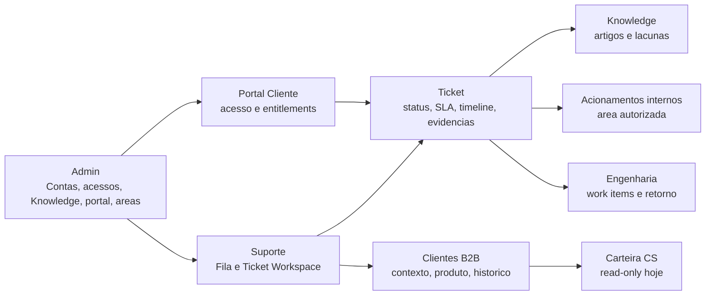

# UX/UI Rebuild Discovery V2

- data: 2026-06-23
- branch de trabalho: `codex/ux-ui-rebuild-v2-discovery`
- origem: plano de continuidade UX/UI V2
- referencias visuais: `C:\Users\edebu\Downloads\ticket workspace.png` (Blueprint 01) e `C:\Users\edebu\Downloads\blueprint.png` (Blueprint 02)
- escopo deste lote: Fase 0 documental; nenhuma UI, contrato, migration, policy, RPC, tabela, seed, secret, deploy ou dado remoto foi alterado.

## 1. Resumo executivo

O Genius Support OS deve ser tratado como cockpit operacional CX B2B, nao como ERP, CRM generico, dashboard ou colecao de cards. A reconstrucao UX/UI V2 precisa partir do fluxo real do ticket e do contrato backend existente: o frontend renderiza read models, dispara RPCs governadas e bloqueia honestamente qualquer acao sem contrato.

Blueprint 01 define a ordem operacional: sidebar contextual, segmentos rapidos, lista de tickets, cabecalho do ticket, conversa em primeiro plano, acoes contextuais e rail compacto. Blueprint 02 define a expressao visual: densidade cockpit, light/dark parity, grid 4 zonas, rail forte, composer fixo, estados claros, sem scroll horizontal e sem scroll global em superficies internas.

O produto ja tem base contratual forte para Suporte, Ticket Workspace, Portal Cliente, Knowledge, Acionamentos Internos e Engenharia. As maiores lacunas para o blueprint V2 sao: tema dark runtime ainda inexistente, global search/topbar ainda nao materializado como padrao, tarefas/board/Kanban sem contrato `operational_tasks`, CS ainda read-only e sem health/follow-up mutavel, e telas administrativas ainda parcialmente com cheiro de ERP/table cockpit em vez de fluxo operacional.

## 2. Auditoria Git antes da Fase 0

Auditoria executada antes de criar a branch:

| Item | Resultado |
| --- | --- |
| branch inicial | `codex/mvp-operational-completion-goal` |
| upstream | `origin/codex/mvp-operational-completion-goal` |
| ahead/behind | `ahead 3`, `behind 0` |
| commits locais ahead | `804c3c7 feat(ui): consolidate operational cockpit and product docs`; `2dd6e1a fix(ui): sanitize operational copy across cockpits`; `fba870d test(ui): harden authenticated visual audit` |
| staged | nenhum arquivo staged |
| dirty tracked | `apps/web/src/features/product-docs/ProductDocReaderPanel.tsx`, `docs/DOCUMENTATION_LEDGER.md`, `docs/README.md` |
| untracked preexistente | `docs/reports/PROJECT_RESTART_DOCUMENTATION_PLAYBOOK_2026-06-22.md` |
| branch criada | `codex/ux-ui-rebuild-v2-discovery` |

Risco registrado: `docs/README.md` e `docs/DOCUMENTATION_LEDGER.md` ja estavam alterados por outro lote documental. Para nao misturar historicos, esta Fase 0 cria documentos auto-contidos e o commit deve stagear apenas arquivos deste lote.

## 3. Leitura dos blueprints

### Blueprint 01 - fluxo operacional

Blueprint 01 organiza o Ticket Workspace como centro de trabalho do ticket:

1. Sidebar contextual por dominio e perfil.
2. Segmentos rapidos para priorizacao da fila.
3. Lista compacta de tickets com ID, titulo, cliente, status, responsavel e timestamp.
4. Cabecalho do ticket com cliente, titulo, status, prioridade, responsavel e proximo passo.
5. Conversa/timeline como plano principal, com diferenca clara entre cliente, sistema, area interna e suporte.
6. Composer fixo com resposta publica, nota interna e acoes adjacentes.
7. Rail contextual com cliente, produto/plano, SLA, demandas relacionadas e retorno tecnico.

O rodape do BP01 explicita o pacote seguinte: Carteira CS, Board de tarefas, Fila operacional, Acionamentos internos, Engenharia/Produto e Administracao. Nesta Fase 0, Board/tarefas fica bloqueado ate existir contrato backend proprio.

### Blueprint 02 - visual, densidade e responsividade

Blueprint 02 consolida a versao V2 visual:

- 4 zonas desktop: sidebar 280px, lista 360px, area central flex, rail 320px.
- Dark mode e Light mode com paridade de hierarquia, nao dois produtos diferentes.
- Conteudo operacional denso, sem cardizacao excessiva.
- Sidebar e topo fixos.
- Composer fixo.
- Conversa e lista com scroll interno.
- Sem scroll horizontal.
- Em `1366px-1439px`, icones/textos devem reduzir; em `1024px-1359px`, rail vira drawer; em mobile, abas.
- Copy deve ser humana e operacional, sem termos tecnicos expostos.

## 4. Inventario de rotas e perfis

| Rota | Superficie | Perfil autorizado | Fonte de gate/contrato | Status UX V2 |
| --- | --- | --- | --- | --- |
| `/` | redirect | qualquer sessao | router -> `/admin` | precisa preservar redirect por papel no login |
| `/login` | autenticacao | anon/autenticado | Auth + `post-login-redirect.ts` | fora do blueprint do cockpit |
| `/access-denied` | bloqueio | autenticado sem acesso | gates e redirect state | precisa copy final sem termos internos |
| `/help` | Public Help resolver | publico | `vw_public_knowledge_space_resolver` | pode ter scroll global; nao segue cockpit interno |
| `/help/:spaceSlug` | Public Help | publico | resolver + navigation publica | fora do cockpit interno |
| `/help/:spaceSlug/articles` | lista publica | publico | `vw_public_knowledge_articles_list` | OK como site publico |
| `/help/:spaceSlug/articles/:articleSlug` | artigo publico | publico | `vw_public_knowledge_article_detail`, assets publicos | OK como site publico |
| `/customer-portal` | redirect legado | customer-facing | router -> `/portal` | manter compatibilidade |
| `/portal` | Portal Cliente | `customer_user`/`customer_manager` com tenant ativo | `vw_customer_portal_*`, `rpc_customer_get_portal_session_status` | cockpit leve customer-facing; nao deve mostrar operacao interna |
| `/portal/tickets` | tickets do cliente | customer-facing autorizado | `vw_customer_portal_ticket_list`, `rpc_customer_create_ticket` | funcional; densidade secundaria |
| `/portal/tickets/:ticketId` | detalhe customer-facing | customer-facing autorizado | detail/timeline/attachments/collaboration state | deve permanecer sem nota interna, engenharia ou SLA interno |
| `/portal/help` | Knowledge autenticada | customer-facing autorizado | `vw_customer_portal_knowledge_articles`, search RPC | funcional |
| `/portal/help/:articleSlug` | artigo autorizado | customer-facing autorizado | `vw_customer_portal_knowledge_article_detail` | funcional |
| `/admin` | redirect admin | `platform_admin` | `AdminGate` + `vw_admin_auth_context` | shell admin precisa aderir melhor ao cockpit V2 |
| `/admin/tenants` | Contas B2B | `platform_admin` | admin read models e RPCs governadas | funcional, mas ainda table/ERP em partes |
| `/admin/knowledge` | Knowledge admin | `platform_admin` | `vw_admin_knowledge_*`, RPCs editoriais | funcional parcial; precisa cockpit editorial V2 |
| `/admin/knowledge/new` | editor artigo | `platform_admin` | RPCs Knowledge v2 | editor funcional; fora do Ticket Workspace |
| `/admin/knowledge/:articleId/edit` | editor artigo | `platform_admin` | detail + RPCs Knowledge v2 | editor funcional |
| `/admin/customer-portal` | governanca portal | `platform_admin` | customer portal admin views/RPCs | funcional; alguns CTAs bloqueados honestamente |
| `/admin/internal-areas` | areas internas | `platform_admin` | `vw_admin_internal_area_memberships`, RPCs area | funcional |
| `/admin/build-journal` | diario interno | `platform_admin` | conteudo versionado/frontend + docs oficiais | narrativa interna; nao cockpit operacional diario |
| `/admin/product-docs` | docs oficiais | `platform_admin` | `vw_internal_documents_catalog`, `vw_internal_document_detail` | leitor governado; observar copy tecnica |
| `/admin/access` | acessos | `platform_admin` | `vw_admin_access_*`, membership RPCs | funcional; precisa polish V2 para governanca |
| `/admin/system` | observabilidade segura | `platform_admin` | `vw_admin_system_*`, `vw_ai_*` | funcional; nao ativar IA real |
| `/cs` | redirect CS | platform admin ou CS autorizado | `CsGate`, `vw_cs_customer_portfolio` | shell existe |
| `/cs/portfolio` | carteira CS | `platform_admin` ou membership `customer_success` | `vw_cs_customer_portfolio` | read-only; health/follow-up/tarefa bloqueados |
| `/support` | redirect suporte | autenticado; acesso real por read models/RPCs | `SupportGate` + views suporte | shell compartilhado |
| `/support/queue` | fila operacional | `platform_admin`, `support_manager`, `support_agent` | `vw_support_tickets_queue`, intake views, `rpc_create_ticket` | base forte para BP01/BP02 |
| `/support/tickets` | tickets | suporte autorizado | `vw_support_tickets_queue`, contextos recentes | precisa se alinhar ao workspace V2 |
| `/support/tickets/:ticketId` | Ticket Workspace | suporte autorizado | detail/timeline/SLA/attachments/knowledge/internal/engineering RPCs | principal alvo da F2 |
| `/support/customers` | clientes suporte | suporte autorizado | `vw_support_customer_360`, account/product context | precisa rail/preview V2 |
| `/support/customers/:tenantId` | cliente suporte | suporte autorizado | customer 360/account/recent events | read-only operacional |
| `/engineering` | fila tecnica | `platform_admin`, `engineering_manager`, `engineering_member` | `vw_engineering_*`, `rpc_engineering_*` | funcional; F3 visual |
| `/engineering/work-items/:workItemId` | detalhe tecnico | engenharia autorizada | detail/links/updates/RPCs | funcional; F3 visual |
| `/internal-actions` | acionamentos | `platform_admin` ou area autorizada | `vw_internal_action_area_auth_context`, queue/detail/timeline | funcional; F3 visual |
| `/internal-actions/:actionId` | detalhe acionamento | area autorizada | detail/timeline/RPCs area | funcional; F3 visual |
| `*` | fallback | qualquer | router -> `/admin` | revisar para default por papel se necessario |

## 5. Contratos reais por dominio

### Suporte e Ticket Workspace

Leituras principais:

- `vw_support_tickets_queue`
- `vw_support_ticket_detail`
- `vw_support_ticket_timeline_recent`
- `rpc_support_get_ticket_timeline`
- `vw_support_customer_360`
- `vw_support_customer_account_context`
- `vw_support_customer_product_context`
- `vw_support_customer_recent_tickets`
- `vw_support_customer_recent_events`
- `vw_support_assignable_agents`
- `vw_support_ticket_intake_tenants`
- `vw_support_ticket_intake_contacts`
- `vw_support_ticket_classification_options`
- `vw_support_ticket_sla_context`
- `vw_support_ticket_knowledge_links`
- `vw_support_ticket_attachments`
- `vw_support_ticket_engineering_links`
- `vw_support_ticket_internal_actions`
- `vw_support_internal_action_detail`
- `vw_support_internal_action_timeline`
- `vw_support_knowledge_article_picker`

Escritas principais:

- `rpc_create_ticket`
- `rpc_support_update_ticket_status_v2`
- `rpc_support_recalculate_ticket_sla`
- `rpc_support_update_ticket_classification`
- `rpc_support_update_ticket_priority_severity`
- `rpc_assign_ticket`
- `rpc_add_ticket_message`
- `rpc_add_internal_ticket_note`
- `rpc_close_ticket`
- `rpc_reopen_ticket`
- `rpc_support_link_ticket_article`
- `rpc_support_archive_ticket_article_link`
- `rpc_support_mark_documentation_gap`
- `rpc_support_mark_article_needs_update`
- `rpc_support_create_ticket_attachment_upload`
- `rpc_support_get_ticket_attachment_download_url`
- `rpc_support_create_engineering_work_item_from_ticket`
- `rpc_support_link_ticket_to_engineering_work_item`
- `rpc_support_create_internal_action`
- `rpc_internal_action_add_evidence_link`
- `rpc_support_accept_internal_action_return`
- `rpc_support_request_internal_action_followup`
- `rpc_support_close_internal_action`

### Acionamentos internos

- Leituras: `vw_internal_action_area_auth_context`, `vw_internal_action_queue_by_area`, `vw_internal_action_detail_by_area`, `vw_internal_action_timeline_by_area`.
- Escritas: `rpc_internal_action_assign_to_self`, `rpc_internal_action_add_comment`, `rpc_internal_action_update_status`, `rpc_internal_action_return_to_support`.

### Engenharia

- Leituras: `vw_engineering_work_items_queue`, `vw_engineering_work_item_detail`, `vw_engineering_work_item_ticket_links`, `vw_engineering_work_item_updates`.
- Escritas: `rpc_engineering_assign_work_item`, `rpc_engineering_unassign_work_item`, `rpc_engineering_update_work_item_status`, `rpc_engineering_add_work_item_update`, `rpc_engineering_return_work_item_to_support`.

### CS

- Leitura atual: `vw_cs_customer_portfolio`.
- Escritas CS: nenhuma aprovada nesta superficie.
- Bloqueios: health canonico, follow-ups, tarefas, projetos e planos de acao ainda exigem contratos backend.

### Portal Cliente

- Leituras: `vw_customer_portal_profile_context`, `vw_customer_portal_available_tenants`, `vw_customer_portal_active_tenant_context`, `vw_customer_portal_ticket_list`, `vw_customer_portal_ticket_detail`, `vw_customer_portal_ticket_timeline`, `vw_customer_portal_ticket_collaboration_state`, `vw_customer_portal_ticket_attachments`, `vw_customer_portal_knowledge_articles`, `vw_customer_portal_knowledge_article_detail`, `vw_customer_portal_ticket_knowledge_links`.
- Escritas: `rpc_customer_get_portal_session_status`, `rpc_customer_set_active_tenant`, `rpc_customer_search_knowledge_articles`, `rpc_customer_create_ticket`, `rpc_customer_add_ticket_message`, `rpc_customer_create_ticket_attachment_upload`, `rpc_customer_get_attachment_download_url`, `rpc_customer_acknowledge_ticket_update`, `rpc_customer_confirm_ticket_resolved`, `rpc_customer_request_ticket_reopen`.

### Administracao

Contratos amplos ja existem para tenants, customer profile, subscriptions, access, system, readiness de canais, readiness AI-native, portal cliente admin, Knowledge, areas internas e documentos internos. A regra para F1-F5 e reaproveitar esses contratos e nunca substituir por regra local.

## 6. CTAs funcionais e bloqueados

### CTAs funcionais com contrato real

| CTA | Superficie | Contrato real |
| --- | --- | --- |
| Novo ticket / Criar cliente ticket | `/support/queue` | `rpc_create_ticket` |
| Enviar resposta | Ticket Workspace | `rpc_add_ticket_message` |
| Salvar nota | Ticket Workspace | `rpc_add_internal_ticket_note` |
| Alterar status | Ticket Workspace | `rpc_support_update_ticket_status_v2` |
| Recalcular SLA | Ticket Workspace | `rpc_support_recalculate_ticket_sla` |
| Atribuir responsavel | Ticket Workspace | `rpc_assign_ticket` |
| Anexar evidencia | Ticket Workspace | upload intent + edge function + RPC de anexo |
| Vincular conhecimento | Ticket Workspace | `rpc_support_link_ticket_article` |
| Marcar lacuna documental | Ticket Workspace | `rpc_support_mark_documentation_gap` |
| Acionar area | Ticket Workspace | `rpc_support_create_internal_action` |
| Criar demanda tecnica | Ticket Workspace | `rpc_support_create_engineering_work_item_from_ticket` |
| Aceitar retorno / Pedir complemento / Encerrar acionamento | Ticket Workspace | `rpc_support_accept_internal_action_return`, `rpc_support_request_internal_action_followup`, `rpc_support_close_internal_action` |
| Assumir acionamento / Registrar update / Devolver ao suporte | `/internal-actions` | `rpc_internal_action_*` |
| Registrar atualizacao / Alterar status / Assumir / Retornar ao suporte | `/engineering` | `rpc_engineering_*` |
| Criar/editar tenant, contato, perfil, integracao, alerta, assinatura | `/admin/tenants` | RPCs administrativas existentes |
| Adicionar membro / salvar acesso | `/admin/access` | membership RPCs endurecidas |
| Conceder artigo / salvar vinculo | `/admin/customer-portal` | RPCs admin de entitlement/link |
| Criar/salvar/publicar artigo | `/admin/knowledge` | RPCs Knowledge v2 |
| Criar ticket / enviar mensagem / enviar evidencia / confirmar resolucao / reabrir | Portal Cliente | RPCs customer-facing |

### CTAs bloqueados ou indisponiveis por contrato

| CTA/ideia | Onde aparece ou e sugerido | Decisao Fase 0 |
| --- | --- | --- |
| Criar tarefa | BP01/BP02 e painel do Ticket Workspace | bloqueado ate existir `operational_tasks`, RLS, audit log, views e RPCs |
| Board de tarefas/Kanban | BP01 pacote seguinte | bloqueado; nao implementar Trello generico |
| Executar playbook | painel contextual do Ticket Workspace | manter indisponivel ate contrato de playbook operacional |
| Compartilhar ticket | painel contextual do Ticket Workspace | manter indisponivel ate contrato de compartilhamento governado |
| Canais externos/email/chat/WhatsApp/API | docs de comunicacao futura | manter bloqueado; Portal e o canal real do MVP |
| Health score CS | `/cs/portfolio` | mostrar `Indisponivel` ate health signals/backend |
| Follow-ups/projetos CS | BP pacote seguinte | bloquear ate contratos CS |
| IA/copilot/resposta automatica | Admin System/AI governance | bloqueado; IA nao executa acao customer-facing |
| Notificacao externa | ticket/portal futuro | bloquear ate provider, outbox, retry, consentimento e auditoria |
| Pausa de SLA/automacao de breach | docs atuais | bloquear ate contrato backend especifico |

## 7. Copy tecnica exposta ou em risco

Achados atuais:

- Existe camada de sanitizacao em `apps/web/src/lib/operational-copy.ts` e sanitizadores locais em Support, CS, Portal e Engenharia. Isso deve virar padrao de superficie, nao excecao.
- `apps/web/src/features/tenants/TenantsPage.tsx` ainda possui placeholder visivel `UUID do perfil, se existir`; isso conflita com a regra de nao expor UUID na UI.
- `apps/web/src/features/support/support-api.ts` contem mensagens de erro com `backend seguro`; se propagadas para usuario, devem virar "operacao segura" ou equivalente.
- `apps/web/src/features/product-docs/ProductDocReaderPanel.tsx` esta modificado no worktree e inclui copy interna como `Markdown sanitizado`; por ser tela administrativa de documentos pode ser aceitavel como linguagem editorial interna, mas deve ser revisado contra a regra de copy humana antes do aceite final.
- Termos como `view`, `RPC`, `RLS`, `payload`, `metadata`, `storage`, `bucket`, `tenant_id`, `UUID` podem existir em codigo, contratos e documentacao tecnica, mas nao devem aparecer em interface operacional.

Regra para F1-F5: qualquer erro tecnico deve ser classificado e traduzido antes de renderizar. Valores de negocio, IDs de rota, payload de RPC e contratos nao devem ser mutados para "melhorar copy"; apenas a apresentacao muda.

## 8. Overflow, scroll, densidade e responsividade

Estado observado por codigo:

- Support Workspace ja possui grid de cockpit com `support-workspace-grid`, fila com scroll interno, thread com `data-ticket-thread-scroll`, composer com `data-ticket-composer` e rail com `data-ticket-rail`.
- O CSS usa breakpoint `min-width: 1280px` para grid com fila, area central e rail. O BP02 exige comportamento especifico em `1366px-1439px` e `1024px-1359px`; portanto F2 deve validar se o breakpoint atual e suficiente ou se precisa de regra intermediaria.
- Admin Tenants, Access e System usam grids `xl` com sidebar/centro/rail e overflow interno; ainda precisam QA visual porque algumas telas possuem muitos formularios/drawers e podem gerar scroll global em viewports menores.
- Internal Actions possui area central com `min-h-[620px]`, que pode pressionar a altura real em notebooks ou 1366x768; validar no Browser antes de aprovar F3.
- Public Help e Portal podem ter scroll global por serem superficies publicas/customer-facing; a regra de "sem scroll global" se aplica principalmente aos cockpits internos.
- O runtime atual declara `color-scheme: light`; dark mode global ainda nao esta materializado.

Matriz obrigatoria futura:

| Viewport | Regra |
| --- | --- |
| 1920x1080 | layout completo com sidebar, fila, centro e rail |
| 1440x900 | layout completo sem truncamento de CTA principal |
| 1366px | texto e metadados reduzidos sem scroll horizontal |
| 1024px-1359px | rail vira drawer/aba e composer continua acessivel |
| mobile | navegacao por abas/stack, sem tabela horizontal |

## 9. Telas com risco de ERP generico

| Superficie | Risco |
| --- | --- |
| `/admin/tenants` | muitos blocos administrativos e formularios; precisa ficar cockpit de contas B2B, nao cadastro ERP |
| `/admin/access` | tabela/rail pode parecer IAM generico; precisa comunicar governanca de acesso e risco |
| `/admin/system` | risco de dashboard de status verde; deve mostrar observabilidade real e bloqueios |
| `/admin/knowledge` | risco de CRUD editorial; precisa fila editorial, risco e publicacao governada |
| `/cs/portfolio` | read-only seguro, mas ainda sem gestao operacional de CS; nao inventar health/follow-up |
| `/support/customers` | risco de ficha cadastral; deve virar contexto operacional B2B para tratativa |

## 10. Conflitos Blueprint x implementacao

| Tema | Blueprint | Implementacao atual | Decisao |
| --- | --- | --- | --- |
| Tema dark | BP02 mostra dark e light | runtime light-only (`color-scheme: light`) | F1 cria paridade real de tema |
| Sidebar contextual | BP01/BP02 agrupam por suporte/operacao/admin e prioridade | navegação minimal por permissao ja existe, mas sem segmentos BP completos | F1/F2 alinham sem copiar labels falsos |
| Global search | BP mostra busca no topo | nao ha contrato global claro para buscar ticket/cliente/assunto em todos dominios | bloquear ou limitar por contrato por dominio |
| Board/tarefas | BP mostra board/tarefa como pacote | `operational_tasks` e RPCs ainda futuros | bloquear ate backend |
| Composer | BP mostra composer fixo com acoes | existe composer fixo e acoes reais/parciais | F2 polir visual e manter contratos |
| Rail | BP exige contexto/acoes forte | existe rail e drawers, mas variam por superficie | padronizar em `OPERATIONAL_UX_PATTERNS_V1` |
| SLA | BP mostra previsao/prazo | SLA interno vem do backend; pausa/breach autom. pendentes | usar apenas sinais existentes |
| Engenharia/Produto | BP01 mostra como proxima tela | Engenharia operacional existe; Produto/demandas qualificadas ainda futuro | F3 cobre engenharia; produto backlog bloqueado |
| Administracao | BP pacote indica clientes/acessos/SLAs/conhecimento | admin tem muitos contratos | F5 reorganiza UX, sem backend novo salvo aprovacao |

## 11. Dependencias entre dominios

Regras de dependencia:

- Ticket e a entidade operacional central; engenharia, acionamento interno e Knowledge nao substituem o ticket.
- Acionamento interno nao altera status do ticket automaticamente.
- Engenharia nao conversa direto com cliente; retorna ao suporte.
- CS nao deve virar suporte paralelo.
- Portal Cliente nao ve nota interna, engenharia, acionamentos, audit bruto, SLA interno ou Knowledge interna.
- Admin governa contratos, acessos e dados operacionais; nao deve virar bypass sem auditoria.

## 12. Plano faseado ate deploy real

### Fase 1 - Fundacao visual e padroes

- Materializar tokens Light/Dark e mecanismo runtime de tema.
- Consolidar shell, sidebar contextual, topbar, rail, drawer, composer e estados.
- Aplicar `docs/OPERATIONAL_UX_PATTERNS_V1.md` como contrato UX.
- Validar sem alterar regra de negocio.

### Fase 2 - Fila + Ticket Workspace

- Alinhar `/support/queue`, `/support/tickets` e `/support/tickets/:ticketId` aos BP01/BP02.
- Manter CTAs reais conectados a RPCs existentes.
- Bloquear tarefas, playbook, compartilhamento e automacoes sem contrato.
- Validar lista, timeline, composer fixo, rail, drawers, anexos, knowledge e SLA.

### Fase 3 - Acionamentos + Engenharia

- Recriar `/internal-actions` e `/engineering` como cockpits densos conectados ao ticket.
- Garantir diferenca visual entre retorno interno, update tecnico e evento de sistema.
- Preservar separacao: engenharia retorna ao suporte; area interna nao fala com cliente.

### Fase 4 - Carteira CS, clientes e tarefas

- Evoluir `/cs/portfolio`, `/support/customers` e `/support/customers/:tenantId`.
- Tarefas/Kanban so entram depois de contrato `operational_tasks`, RLS, views, RPCs e audit trail.
- Health/follow-ups/projetos de CS permanecem indisponiveis ate backend.

### Fase 5 - Administracao e acabamento final

- Refinar `/admin/tenants`, `/admin/access`, `/admin/system`, `/admin/knowledge`, `/admin/customer-portal`, `/admin/internal-areas`, `/admin/product-docs`.
- Remover cheiro de ERP generico e padronizar rails/drawers/empty/error.
- Rodar auditoria visual completa e regressao de copy.

### Deploy real

- Local: gates de typecheck/build/documentacao e QA visual.
- Preview/staging: somente com aprovacao de deploy e ambiente configurado.
- Supabase remoto: apenas dry-run/execucao autorizada; `db push` remoto exige confirmacao.
- Producao: merge/push/deploy somente com aprovacao explicita, checklist de rollback e validacao pos-deploy.

## 13. Decisoes que precisam aprovacao

1. Escopo do dark mode: global para app interno ou primeiro Support Workspace.
2. Contrato de busca global: ticket/cliente/assunto por dominio ou busca unificada futura.
3. Nomenclatura final da sidebar: seguir BP literal ou adaptar aos dominios atuais.
4. Board/tarefas: aprovar ou adiar contrato `operational_tasks`.
5. CS: manter read-only ou priorizar contratos de health/follow-up/projetos.
6. Pausa de SLA, breach e notificacoes: manter bloqueado ou iniciar lote backend.
7. Produto/Engineering demand intake: manter engenharia operacional ou abrir demanda de produto qualificada.
8. Resolucao da sujeira Git preexistente em `docs/README.md`, `docs/DOCUMENTATION_LEDGER.md`, `ProductDocReaderPanel.tsx` e playbook untracked.

## 14. Gates de validacao

Para este lote documental:

- `npm run documentation:validate:internal-docs`
- `npm run contracts:typecheck`
- `npm run web:typecheck`
- `npm run web:build`
- `git diff --check`
- revisao de `git status --short --branch`

Para fases com UI:

- Browser/Playwright em 1920x1080, 1440x900, 1366px e mobile.
- Registrar `window.innerWidth`, `window.innerHeight`, `document.scrollingElement.scrollHeight`, `document.scrollingElement.clientHeight`.
- Confirmar scroll global, scroll horizontal e containers internos.
- Validar Light/Dark.
- Validar keyboard/focus/ARIA/target size.
- Rodar auditoria final similar ao `docs/reports/visual-audit/run-final-audit-r11.cjs`.

Para backend alterado:

- `npm run supabase:db:reset`
- `npm run supabase:lint:db`
- `npm run supabase:test:db`
- `npm run supabase:verify`

## 15. Conclusao da Fase 0

O caminho seguro e aprovar primeiro esta descoberta e o catalogo de padroes. A implementacao visual deve comecar pela fundacao de tema/shell/padroes e depois pelo Ticket Workspace, sempre reaproveitando contratos reais e bloqueando CTAs futuros com copy honesta. Qualquer tentativa de entregar o BP01/BP02 criando tarefas, automacao, notificacao, busca global ou IA sem backend seria regressao arquitetural.
